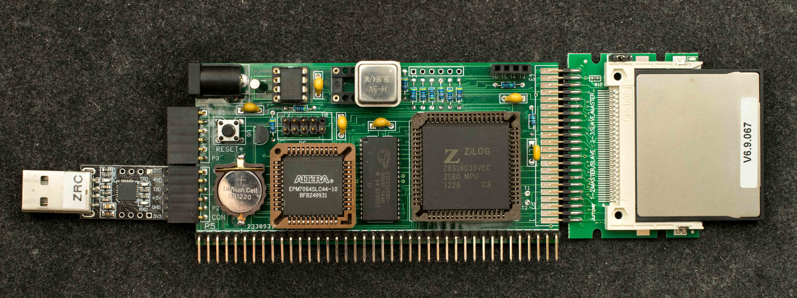

# Z1RCC Overclocked to 36.8MHz
### Introduction
Z1RCC is a RomWBW-capable Z180 SBC based on Z80180; its nominal operating frequency is 9.216MHz. With newer and faster Z8S180, it can be overclocked to 36.8MHz.

