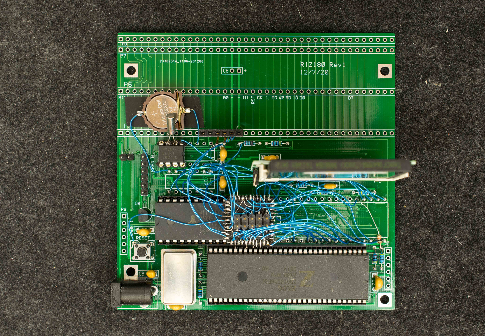
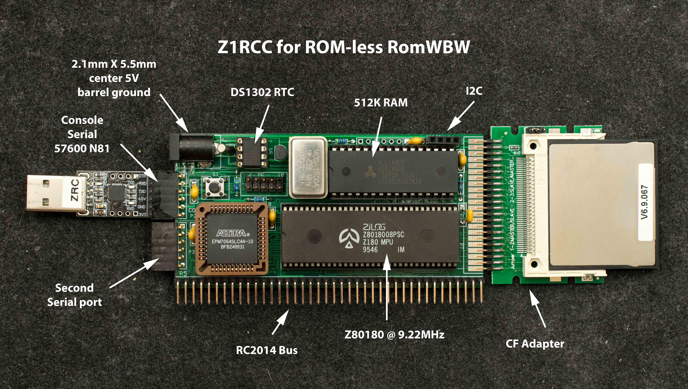
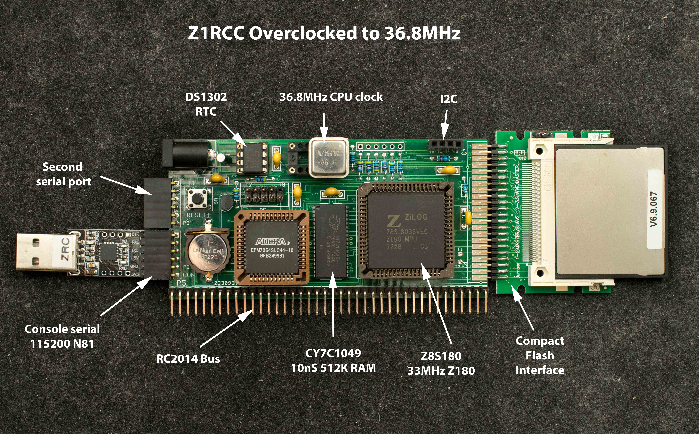

# Z1RCC
a RC2014-compatible, RomWBW-capable Z180 SBC. The motivation came from a new RomWBW feature that accommodates ROM-less Z80/Z180/Z280 computer with 512K of RAM. 

Current version of Z1RCC is [rev0](Rev0)

