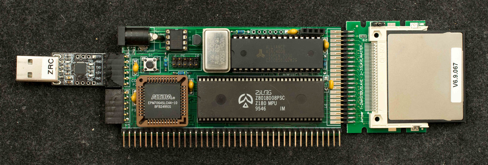

# Z1RCC, A RC2014-Compatible, RomWBW-Capable Z180 SBC
### Introduction
Z1RCC is a 2“x4” RomWBW-capable Z180 SBC. This is link to prototype of Z1RCC. Online discussion about Z1RCC here

### Features
- Z180 at 9.216MHz
- 512KB RAM
- EPM7064S CPLD
  - 64-byte bootstrap ROM in CPLD
  - DS1302 RTC
  - I2C bus
- RC2014-compatible bus
- IDE44 CF interface
- 2“x4”, 2-layer pc board

### Theory of Operation
DIP64 version of Z180 can only support 512K memory space so it is challenging to have 512K RAM and 512K ROM that RomWBW needed. However, Wayne Warthen has created a version of RomWBW that needs no ROM, only 512K RAM. This version of RomWBW produces a 512K image and requires the external hardware/software to load the image into RAM then jumps to 0x0 to start RomWBW. Notably, the top 32K of the 512K image is the common area that RomWBW actively use while running, but it does not need to be initialized for RomWBW. So the RomWBW image is effectively 480K with the top 32K of 512K RAM available for temporary utility software like loader that'll be overwritten once RomWBW has started.

With that operating characteristic in mind, Z1RCC has no flash memory on board but has a small (64 bytes) bootstrap ROM in CPLD so that Z180 boots from this bootstrap ROM, copies a loader from CF disk to top 32K of RAM, runs the loader to bring in the 480K RomWBW image from CF disk, then start RomWBW from 0x0.

### Design Information
- Schematic
- Gerber photoplots
- CPLD design files
- Bill of Materials
- Memory map

### Software
